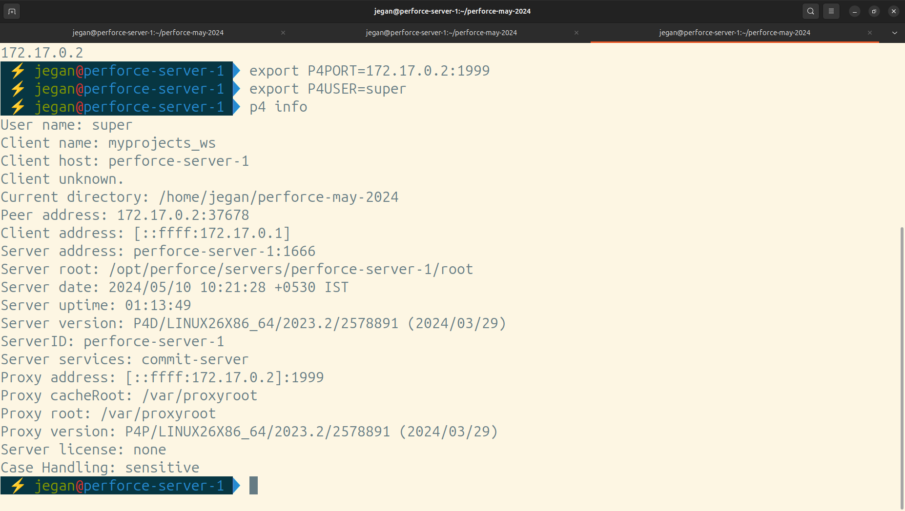

# Day 5

## Lab - Cloning this TekTutor Perforce Training Repository ( only the first time )
```
cd ~
git clone https://github.com/tektutor/perforce-may-2024.git
```

## Lab - Installing Docker Community Edition in Ubuntu 
```
# Add Docker's official GPG key:
sudo apt-get update
sudo apt-get install ca-certificates curl
sudo install -m 0755 -d /etc/apt/keyrings
sudo curl -fsSL https://download.docker.com/linux/ubuntu/gpg -o /etc/apt/keyrings/docker.asc
sudo chmod a+r /etc/apt/keyrings/docker.asc

# Add the repository to Apt sources:
echo \
  "deb [arch=$(dpkg --print-architecture) signed-by=/etc/apt/keyrings/docker.asc] https://download.docker.com/linux/ubuntu \
  $(. /etc/os-release && echo "$VERSION_CODENAME") stable" | \
  sudo tee /etc/apt/sources.list.d/docker.list > /dev/null
sudo apt-get update

sudo apt-get install docker-ce docker-ce-cli containerd.io docker-buildx-plugin docker-compose-plugin

sudo usermod -aG docker $USER
sudo su $USER
```


## Lab - Building Custom Docker image to run helix-proxy server

Before you proceed to build the image, you need to edit the Dockerfile and update the IP '172.20.10.5' to your RPS lab machine IPAddress '192.168.5.x', the x would vary for each one of you.
```
cd ~/perforce-may-2024
git pull
cd Day5/custom-helixproxy-docker-image
docker build -t tektutor/helix-proxy:latest .
```

Check if the image is built successfully
```
docker images
```

## Lab - Create Perforce helix proxy server container
```
docker run -d --name helix-proxy --hostname helix-proxy tektutor/helix-proxy:latest
docker ps
docker inspect -f {{.NetworkSettings.IPAddress}} helix-proxy 
export P4PORT=172.17.0.2:1999
p4 info
p4 depots
```

Open the first terminal window and try this


On the second terminal window, try this

